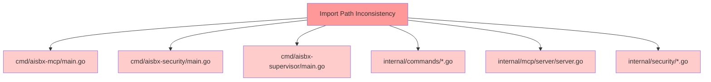
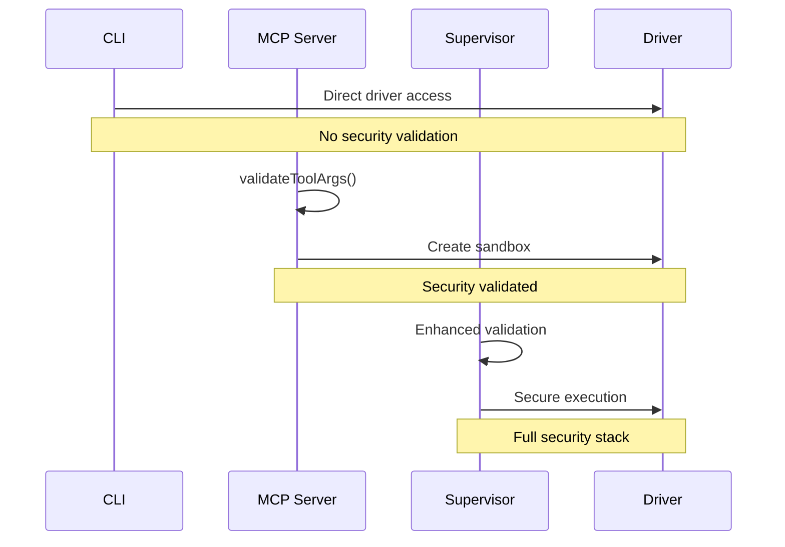
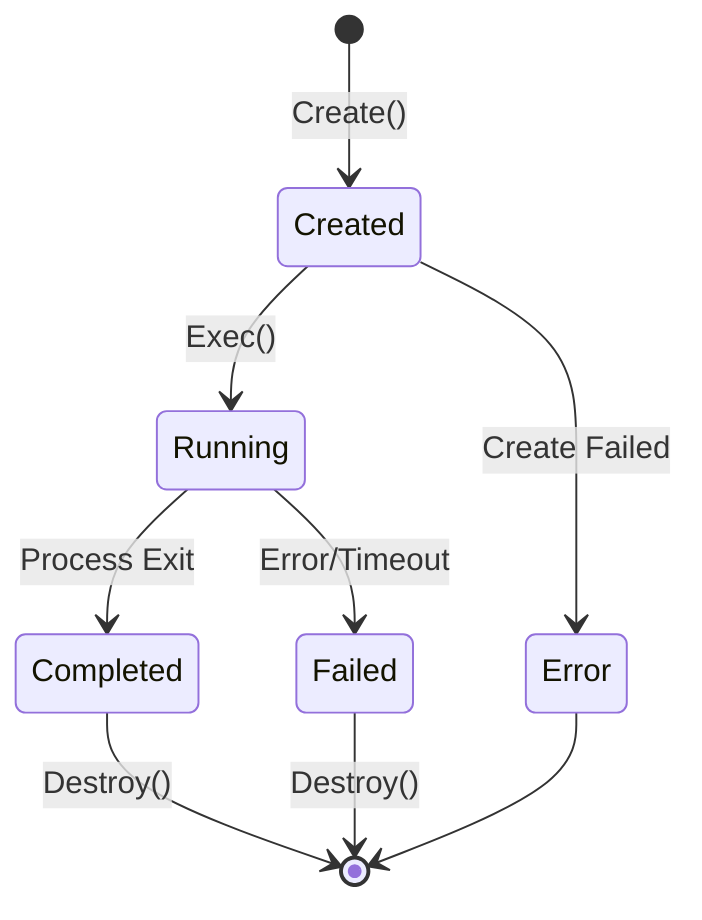
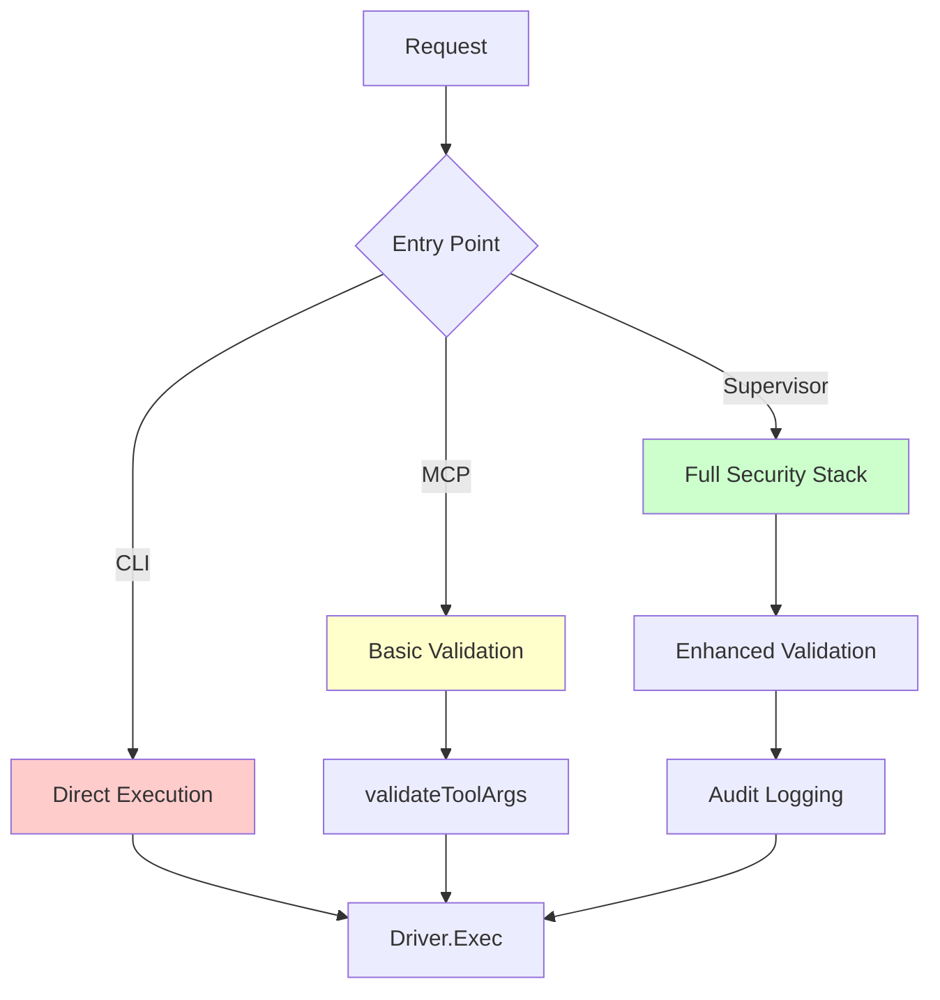
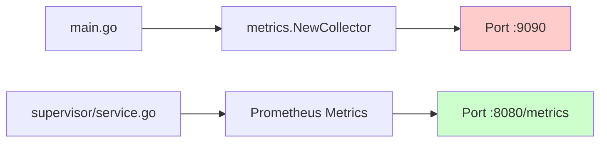

# File Structure Validator Design Document

## Overview

This document analyzes the Phantom Fragment project's file organization and component interactions to identify structural issues, dependency problems, and integration gaps that could impact system reliability and maintainability.

## Architecture Analysis

### Current Directory Structure

```
phantom-fragment/
├── cmd/                    # Multiple entry points
│   ├── aisbx/             # CLI interface
│   ├── aisbx-mcp/         # MCP server
│   ├── aisbx-security/    # Security service
│   ├── aisbx-supervisor/  # Supervisor service
│   └── phantom-benchmark/ # Benchmarking tool
├── internal/              # Core implementation
│   ├── benchmarks/        # Performance testing
│   ├── commands/          # CLI commands
│   ├── config/           # Configuration management
│   ├── fragments/        # Core container fragments
│   ├── io/               # I/O optimization
│   ├── mcp/              # Model Context Protocol
│   ├── metrics/          # Monitoring
│   ├── orchestrator/     # Container orchestration
│   ├── policy/           # Policy compilation
│   ├── rootfs/           # Root filesystem management
│   ├── security/         # Security components
│   └── supervisor/       # Service management
├── pkg/                  # Public interfaces
│   ├── bwrap/           # Bubblewrap wrapper
│   ├── driver/          # Driver interface
│   ├── rootfs/          # Rootfs utilities
│   └── types/           # Core data types
└── main.go              # JSON-RPC server entry
```

## Critical Issues Identified

### 1. Import Path Inconsistencies

**Issue**: Mixed import paths causing compilation failures
- Legacy imports: `github.com/you/ai-sandbox/*` (25+ files)
- Current imports: `github.com/phantom-fragment/phantom-fragment/*` (22+ files)

**Impact**: 
- Build failures across multiple modules
- Dependency resolution conflicts
- Runtime import errors

**Files Affected**:


### 2. Missing go.mod Configuration

**Issue**: No Go module definition found
- Missing `go.mod` file
- Undefined module dependencies
- Version conflicts potential

**Impact**:
- Cannot resolve external dependencies
- Build process failures
- Dependency management issues

### 3. Driver Interface Mismatch

**Issue**: Interface inconsistency in driver implementations

**Analysis**:
```go
// pkg/driver/driver.go - Interface Definition
type SandboxDriver interface {
    Create(ctx context.Context, image, workdir string, binds []string, env map[string]string) (string, error)
    Exec(ctx context.Context, container types.Container, cmd []string, timeoutMs int, memoryLimitMB int, cpuLimitCores int) (int, string, string, error)
    Destroy(ctx context.Context, containerID string) error
}

// main.go - Usage Pattern
sandboxDriver.Create(ctx, params.Image, params.Workdir, params.Binds, params.Env)
sandboxDriver.Exec(ctx, container, params.Cmd, params.TimeoutMS, params.MemoryLimitMB, params.CPULimitCores)
```

**Validation Status**: ✅ Interface contract matches usage patterns

### 4. Component Integration Gaps

**Issue**: Inconsistent component initialization and lifecycle management

**Problems Identified**:

| Component | Initialization | Error Handling | Cleanup |
|-----------|---------------|----------------|---------|
| Metrics Server | ✅ Proper | ⚠️ Partial | ✅ Proper |
| Driver Factory | ✅ Proper | ✅ Complete | ❌ Missing |
| MCP Server | ⚠️ Incomplete | ⚠️ Partial | ❌ Missing |
| Config System | ❌ Missing | ❌ Missing | ❌ Missing |

### 5. Security Component Integration

**Issue**: Security validation inconsistencies between services

**Analysis**:


**Problem**: Inconsistent security enforcement across entry points

## Architectural Patterns Analysis

### 1. Factory Pattern Implementation

**Location**: `pkg/driver/factory.go`

**Validation**:
```go
// ✅ Proper factory implementation
func New(driverType string) (SandboxDriver, error) {
    switch driverType {
    case "bwrap", "bubblewrap":
        return NewChrootDriver(), nil
    case "lima":
        return NewLimaDriver(), nil
    case "auto":
        // Platform detection logic
    }
}
```

**Issues**:
- Missing driver validation
- No driver capability checking
- Platform compatibility not verified

### 2. Command Pattern Usage

**Location**: `internal/commands/*.go`

**Structure Analysis**:
```
commands/
├── create.go    # Container creation
├── destroy.go   # Container cleanup  
├── init.go      # System initialization
├── logs.go      # Log management
├── profile.go   # Profile management
└── run.go       # Code execution
```

**Validation**: ✅ Proper command separation and encapsulation

### 3. Strategy Pattern (Drivers)

**Implementations**:
- `ChrootDriver` - Linux isolation
- `LimaDriver` - Cross-platform virtualization
- Factory selects strategy based on platform

**Issues**:
- Missing driver interface validation
- No fallback strategy implementation
- Error handling inconsistencies

## Data Flow Validation

### 1. Container Lifecycle



**Validation Issues**:
- No state persistence mechanism
- Missing state transition validation
- Cleanup not guaranteed on failures

### 2. Configuration Flow

```mermaid
graph LR
    A[config.yaml] --> B[Config.DefaultConfig()]
    B --> C[Profile Selection]
    C --> D[Driver Factory]
    D --> E[Sandbox Creation]
    
    F[CLI Args] --> C
    G[MCP Params] --> C
    H[Supervisor API] --> C
```

**Issues**:
- No configuration validation
- Missing profile inheritance
- Environment variable conflicts

### 3. Security Enforcement Flow



**Critical Gap**: Inconsistent security enforcement

## Component Interaction Validation

### 1. MCP Server Integration

**Issues**:
```go
// cmd/aisbx-mcp/main.go
func executeRunCommand(args map[string]interface{}) (*types.ToolResult, error) {
    // ❌ Uses wrong import path
    drv, err := driver.New(profile.Driver)
    
    // ⚠️ No proper error context
    containerID, err := drv.Create(context.Background(), "alpine", ".", nil, nil)
    
    // ❌ Missing cleanup on error
    exitCode, stdout, stderr, err := drv.Exec(...)
}
```

### 2. Supervisor Service Integration

**Analysis**:
```go
// internal/supervisor/service.go
func (s *Service) createSecureTool(toolType string) func(...) {...} {
    return func(args map[string]interface{}) (*types.ToolResult, error) {
        // ✅ Proper validation
        if err := s.validateToolArgs(toolType, args); err != nil {
            // ✅ Security logging
            s.auditLogger.LogSecurityViolation(...)
            return &types.ToolResult{IsError: true}, nil
        }
        // ✅ Comprehensive implementation
    }
}
```

**Status**: ✅ Proper implementation pattern

### 3. Metrics Collection Integration

**Current State**:
```go
// main.go
metricsCollector = metrics.NewCollector()
metricsServer = metrics.NewServer(":9090")
```

**Issues**:
- No metrics aggregation between services
- Missing cross-service correlation
- No centralized metrics collection

## Testing Strategy Validation

### Current Test Coverage

```
tests/
├── pkg/bwrap/bwrap_test.go          # ✅ Unit tests
├── internal/security/seccomp/       # ✅ Unit tests
└── scripts/
    ├── test-mcp-integration.ps1     # ✅ Integration tests
    └── test-mcp-integration.sh      # ✅ Integration tests
```

**Gaps Identified**:
- No driver integration tests
- Missing configuration validation tests
- No security component integration tests
- No end-to-end workflow tests

## Recommendations

### 1. Critical Path Fixes

**Priority 1 (Immediate)**:
1. **Import Path Standardization**
   - Create proper `go.mod` with correct module path
   - Update all imports to use consistent path
   - Validate build across all entry points

2. **Driver Interface Validation**
   - Add runtime interface compliance checks
   - Implement proper error context propagation
   - Add driver capability validation

**Priority 2 (Short-term)**:
1. **Security Harmonization**
   - Implement unified security validation middleware
   - Standardize security enforcement across all entry points
   - Add comprehensive audit logging

2. **Configuration Management**
   - Add configuration validation layer
   - Implement profile inheritance system
   - Add environment-specific overrides

### 2. Architectural Improvements

**Component Lifecycle Management**:
```go
type ComponentLifecycle interface {
    Initialize(ctx context.Context) error
    Start(ctx context.Context) error
    Stop(ctx context.Context) error
    Cleanup() error
}
```

**Unified Service Registry**:
```go
type ServiceRegistry struct {
    components map[string]ComponentLifecycle
    metrics    *metrics.Collector
    audit      *audit.Logger
}
```

### 3. Integration Validation Framework

**Proposed Testing Matrix**:

| Component | Unit Tests | Integration Tests | E2E Tests |
|-----------|------------|-------------------|-----------|
| Driver Factory | ✅ | ❌ Missing | ❌ Missing |
| MCP Server | ❌ Missing | ❌ Missing | ✅ |
| Supervisor | ❌ Missing | ❌ Missing | ❌ Missing |
| Security Stack | ✅ Partial | ❌ Missing | ❌ Missing |
| Configuration | ❌ Missing | ❌ Missing | ❌ Missing |

## Implementation Validation Checklist

### Build System
- [ ] Create `go.mod` with correct module path
- [ ] Update all import statements
- [ ] Validate build for all entry points
- [ ] Test cross-platform compilation

### Runtime Validation
- [ ] Driver interface compliance testing
- [ ] Configuration validation implementation
- [ ] Security policy enforcement verification
- [ ] Resource cleanup validation

### Integration Testing
- [ ] Component interaction testing
- [ ] Service lifecycle testing  
- [ ] Error propagation validation
- [ ] Performance regression testing

### Security Validation
- [ ] Unified security middleware implementation
- [ ] Cross-service audit correlation
- [ ] Input validation harmonization
- [ ] Attack surface analysis

## Monitoring & Observability

### Current Metrics Coverage



**Issue**: Fragmented metrics collection

**Recommendation**: Centralized metrics aggregation with service correlation

### Audit Trail Validation

**Current State**: Only supervisor service has comprehensive audit logging

**Requirement**: Implement unified audit trail across all entry points

## Conclusion

The Phantom Fragment project exhibits a solid architectural foundation but suffers from critical integration issues that impact reliability and maintainability. The primary concerns are import path inconsistencies, missing module configuration, and fragmented security enforcement.

**Immediate Actions Required**:
1. Fix import path inconsistencies
2. Create proper Go module configuration  
3. Implement unified security middleware
4. Add comprehensive integration testing

**Success Metrics**:
- ✅ All entry points build successfully
- ✅ Consistent security enforcement across services
- ✅ Comprehensive audit logging implementation
- ✅ Zero critical security gaps
- ✅ >90% test coverage for critical paths// main.go
metricsCollector = metrics.NewCollector()
metricsServer = metrics.NewServer(":9090")
```

**Issues**:
- No metrics aggregation between services
- Missing cross-service correlation
- No centralized metrics collection

## Testing Strategy Validation

### Current Test Coverage

```
tests/
├── pkg/bwrap/bwrap_test.go          # ✅ Unit tests
├── internal/security/seccomp/       # ✅ Unit tests
└── scripts/
    ├── test-mcp-integration.ps1     # ✅ Integration tests
    └── test-mcp-integration.sh      # ✅ Integration tests
```

**Gaps Identified**:
- No driver integration tests
- Missing configuration validation tests
- No security component integration tests
- No end-to-end workflow tests

## Recommendations

### 1. Critical Path Fixes

**Priority 1 (Immediate)**:
1. **Import Path Standardization**
   - Create proper `go.mod` with correct module path
   - Update all imports to use consistent path
   - Validate build across all entry points

2. **Driver Interface Validation**
   - Add runtime interface compliance checks
   - Implement proper error context propagation
   - Add driver capability validation

**Priority 2 (Short-term)**:
1. **Security Harmonization**
   - Implement unified security validation middleware
   - Standardize security enforcement across all entry points
   - Add comprehensive audit logging

2. **Configuration Management**
   - Add configuration validation layer
   - Implement profile inheritance system
   - Add environment-specific overrides

### 2. Architectural Improvements

**Component Lifecycle Management**:
```go
type ComponentLifecycle interface {
    Initialize(ctx context.Context) error
    Start(ctx context.Context) error
    Stop(ctx context.Context) error
    Cleanup() error
}
```

**Unified Service Registry**:
```go
type ServiceRegistry struct {
    components map[string]ComponentLifecycle
    metrics    *metrics.Collector
    audit      *audit.Logger
}
```

### 3. Integration Validation Framework

**Proposed Testing Matrix**:

| Component | Unit Tests | Integration Tests | E2E Tests |
|-----------|------------|-------------------|-----------|
| Driver Factory | ✅ | ❌ Missing | ❌ Missing |
| MCP Server | ❌ Missing | ❌ Missing | ✅ |
| Supervisor | ❌ Missing | ❌ Missing | ❌ Missing |
| Security Stack | ✅ Partial | ❌ Missing | ❌ Missing |
| Configuration | ❌ Missing | ❌ Missing | ❌ Missing |

## Implementation Validation Checklist

### Build System
- [ ] Create `go.mod` with correct module path
- [ ] Update all import statements
- [ ] Validate build for all entry points
- [ ] Test cross-platform compilation

### Runtime Validation
- [ ] Driver interface compliance testing
- [ ] Configuration validation implementation
- [ ] Security policy enforcement verification
- [ ] Resource cleanup validation

### Integration Testing
- [ ] Component interaction testing
- [ ] Service lifecycle testing  
- [ ] Error propagation validation
- [ ] Performance regression testing

### Security Validation
- [ ] Unified security middleware implementation
- [ ] Cross-service audit correlation
- [ ] Input validation harmonization
- [ ] Attack surface analysis

## Monitoring & Observability

### Current Metrics Coverage


**Issue**: Fragmented metrics collection

**Recommendation**: Centralized metrics aggregation with service correlation

### Audit Trail Validation

**Current State**: Only supervisor service has comprehensive audit logging

**Requirement**: Implement unified audit trail across all entry points

## Conclusion

The Phantom Fragment project exhibits a solid architectural foundation but suffers from critical integration issues that impact reliability and maintainability. The primary concerns are import path inconsistencies, missing module configuration, and fragmented security enforcement.

**Immediate Actions Required**:
1. Fix import path inconsistencies
2. Create proper Go module configuration  
3. Implement unified security middleware
4. Add comprehensive integration testing

**Success Metrics**:
- ✅ All entry points build successfully
- ✅ Consistent security enforcement across services
- ✅ Comprehensive audit logging implementation
- ✅ Zero critical security gaps
- ✅ >90% test coverage for critical paths


