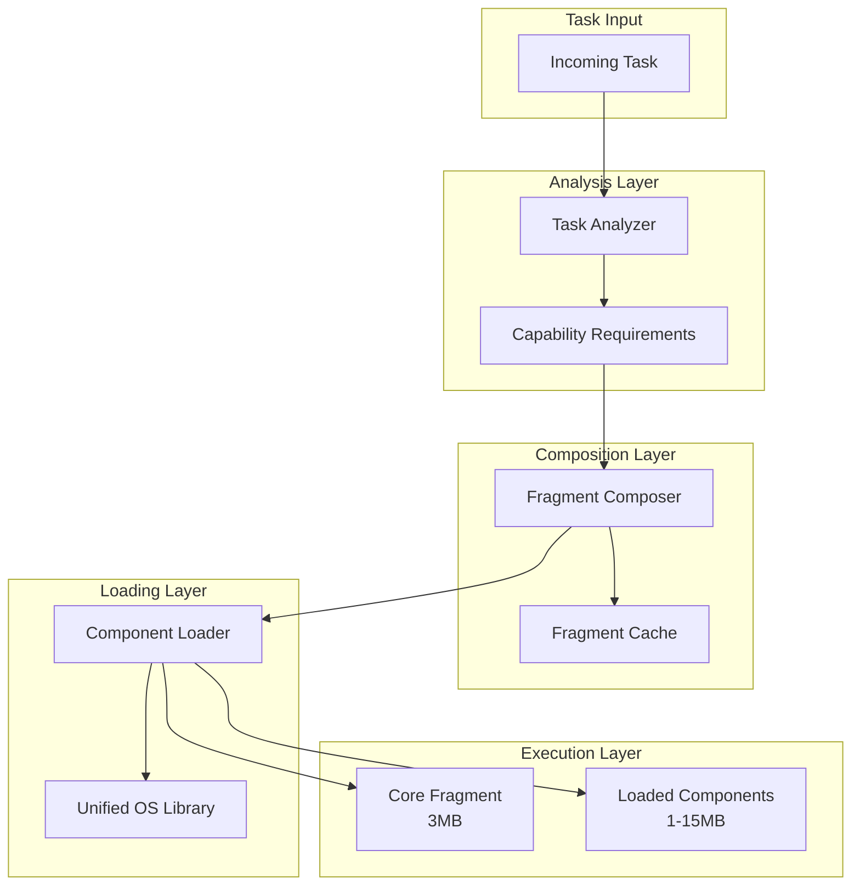

# Modular Fragment System Documentation

## Table of Contents
- [Overview](#overview)
- [Architecture](#architecture)
- [Components](#components)
- [API Reference](#api-reference)
- [Usage Examples](#usage-examples)
- [Performance Characteristics](#performance-characteristics)
- [Configuration](#configuration)
- [Troubleshooting](#troubleshooting)

## Overview

The **Modular Fragment System** is a revolutionary approach to containerization that enables dynamic composition of system capabilities based on actual task requirements. Instead of loading a full operating system, the system intelligently loads only the specific components needed for each task.

### Key Benefits

- **🎯 Dynamic Composition**: Fragments composed on-demand based on task analysis
- **🧩 True Modularity**: Independent components with no forced dependencies
- **⚡ Performance Optimized**: 3MB base, scales to 18MB based on actual needs
- **💾 Memory Efficient**: Only loaded components consume memory
- **🔄 Intelligent Caching**: Frequently used fragments cached for instant reuse

## Architecture

### System Components



### Core Fragment (3MB)

The core fragment provides essential process execution capabilities:

- **Process Management**: Spawning, lifecycle management
- **Security**: Basic seccomp, capabilities, namespaces
- **Runtime**: Minimal execution environment
- **Always Available**: No loading time required

## Components

### Network Components

#### TCP Stack (2MB)
- **Capabilities**: `tcp_connections`, `tcp_listen`
- **Load Time**: 50ms
- **Use Cases**: HTTP clients, servers, network applications

#### DNS Resolver (1MB)
- **Capabilities**: `dns_lookup`, `dns_cache`
- **Load Time**: 30ms
- **Use Cases**: Domain resolution, DNS queries

#### Socket API (1MB)
- **Capabilities**: `socket_create`, `socket_bind`
- **Load Time**: 25ms
- **Use Cases**: Low-level socket operations

### OS Service Components

#### Init System (6MB)
- **Capabilities**: `process_management`, `service_start`
- **Load Time**: 200ms
- **Use Cases**: Service management, process supervision

#### Service Manager (3MB)
- **Capabilities**: `service_control`, `service_status`
- **Load Time**: 100ms
- **Use Cases**: Service lifecycle management

#### Device Manager (2MB)
- **Capabilities**: `device_access`, `device_control`
- **Load Time**: 75ms
- **Use Cases**: Hardware access, device management

### Process Management Components

#### Job Control (1MB)
- **Capabilities**: `job_control`
- **Load Time**: 40ms
- **Use Cases**: Process groups, job management

#### Signal Handling (1MB)
- **Capabilities**: `signal_handling`
- **Load Time**: 35ms
- **Use Cases**: Signal processing, inter-process communication

#### Advanced Process Management (1MB)
- **Capabilities**: `advanced_proc_mgmt`
- **Load Time**: 45ms
- **Use Cases**: Process monitoring, debugging

## API Reference

### FragmentManager

#### `NewModularFragmentManager() (*ModularFragmentManager, error)`
Creates a new modular fragment manager instance.

```go
manager, err := fragments.NewModularFragmentManager()
if err != nil {
    log.Fatal(err)
}
defer manager.Shutdown()
```

#### `ProcessTask(task *Task) (*ComposedFragment, error)`
Processes a task and returns the appropriate composed fragment.

```go
task := fragments.NewTask("curl", "https://example.com")
fragment, err := manager.ProcessTask(task)
```

#### `GetSystemInfo() map[string]interface{}`
Returns comprehensive system information including component status and metrics.

```go
info := manager.GetSystemInfo()
```

#### `GetPerformanceMetrics() map[string]interface{}`
Returns performance metrics and statistics.

```go
metrics := manager.GetPerformanceMetrics()
```

### Task

#### `NewTask(command string, args ...string) *Task`
Creates a new task with the specified command and arguments.

```go
task := fragments.NewTask("echo", "Hello", "World")
```

#### `SetEnvironment(env map[string]string) *Task`
Sets environment variables for the task.

```go
task.SetEnvironment(map[string]string{
    "HTTP_PROXY": "http://proxy:8080",
})
```

#### `SetWorkdir(workdir string) *Task`
Sets the working directory for the task.

```go
task.SetWorkdir("/tmp")
```

#### `SetTimeout(timeout time.Duration) *Task`
Sets the execution timeout for the task.

```go
task.SetTimeout(30 * time.Second)
```

#### `SetPriority(priority TaskPriority) *Task`
Sets the priority for the task.

```go
task.SetPriority(fragments.TaskPriorityHigh)
```

### Component Management

#### `PreloadComponent(componentName string) error`
Preloads a specific component for faster access.

```go
err := manager.PreloadComponent("tcp-stack")
```

#### `UnloadComponent(componentName string) error`
Unloads a specific component to free memory.

```go
err := manager.UnloadComponent("tcp-stack")
```

#### `ListAvailableComponents() map[string]interface{}`
Lists all available components with their current status.

```go
components := manager.ListAvailableComponents()
```

## Usage Examples

### Basic Usage

```go
package main

import (
    "fmt"
    "log"
    "github.com/phantom-fragment/phantom-fragment/pkg/fragments"
)

func main() {
    // Create fragment manager
    manager, err := fragments.NewModularFragmentManager()
    if err != nil {
        log.Fatal(err)
    }
    defer manager.Shutdown()
    
    // Process a simple task
    task := fragments.NewTask("echo", "Hello, World!")
    fragment, err := manager.ProcessTask(task)
    if err != nil {
        log.Fatal(err)
    }
    
    fmt.Printf("Created fragment: %s (%.1f MB)\n", 
        fragment.ID, float64(fragment.TotalSize)/(1024*1024))
}
```

### Network Task Example

```go
// Create a network task
networkTask := fragments.NewTask("curl", "-I", "https://example.com").
    SetEnvironment(map[string]string{
        "HTTP_PROXY": "http://proxy:8080",
    }).
    SetTimeout(30 * time.Second)

// Process the task
fragment, err := manager.ProcessTask(networkTask)
if err != nil {
    log.Fatal(err)
}

fmt.Printf("Network fragment: %s (%.1f MB)\n", 
    fragment.ID, float64(fragment.TotalSize)/(1024*1024))
fmt.Printf("Components loaded: %d\n", len(fragment.Components))
```

### System Administration Task

```go
// Create a system task
systemTask := fragments.NewTask("systemctl", "status", "docker").
    SetPriority(fragments.TaskPriorityHigh).
    SetTimeout(15 * time.Second)

// Process the task
fragment, err := manager.ProcessTask(systemTask)
if err != nil {
    log.Fatal(err)
}

fmt.Printf("System fragment: %s (%.1f MB)\n", 
    fragment.ID, float64(fragment.TotalSize)/(1024*1024))
```

### Component Management

```go
// Preload commonly used components
commonComponents := []string{"tcp-stack", "dns-resolver", "socket-api"}
for _, component := range commonComponents {
    err := manager.PreloadComponent(component)
    if err != nil {
        fmt.Printf("Failed to preload %s: %v\n", component, err)
    }
}

// Get component information
info, err := manager.GetComponentInfo("tcp-stack")
if err != nil {
    log.Fatal(err)
}

fmt.Printf("TCP Stack: %.1f MB, Loaded: %v\n", 
    info["size_mb"], info["loaded"])
```

## Performance Characteristics

### Size Scaling

| Task Type | Components | Total Size | Use Cases |
|-----------|------------|------------|-----------|
| **Simple** | Core only | 3MB | Basic commands, scripts |
| **DNS** | Core + DNS | 4MB | Domain resolution |
| **Network** | Core + TCP + DNS + Socket | 7MB | HTTP clients, network apps |
| **System** | Core + Init | 9MB | Service management |
| **Full OS** | Core + All | 18MB | Complete system operations |

### Load Times

| Component Size | Load Time | Examples |
|----------------|-----------|----------|
| **Small (1MB)** | 25-35ms | DNS resolver, signal handling |
| **Medium (2-3MB)** | 50-100ms | TCP stack, service manager |
| **Large (6MB)** | 200ms | Init system |

### Memory Usage

- **Base Memory**: 3MB (core fragment)
- **Per Component**: 1-6MB depending on component
- **Total Maximum**: 18MB (all components loaded)
- **Automatic Cleanup**: Unused components cleaned up after 5 minutes

## Configuration

### Environment Variables

```bash
# Cache configuration
export PHANTOM_FRAGMENT_CACHE_SIZE=100
export PHANTOM_FRAGMENT_CLEANUP_INTERVAL=300s

# Preloading
export PHANTOM_FRAGMENT_PRELOAD_COMPONENTS="tcp-stack,dns-resolver"

# Performance tuning
export PHANTOM_FRAGMENT_MAX_CONCURRENT_LOADS=10
export PHANTOM_FRAGMENT_LOAD_TIMEOUT=30s
```

### Configuration File

```yaml
# phantom-fragment.yaml
fragments:
  core:
    size: 3MB
    capabilities: ["process_execution"]
  
  components:
    tcp-stack:
      size: 2MB
      capabilities: ["tcp_connections", "tcp_listen"]
      load_time: 50ms
      preload: true
    
    dns-resolver:
      size: 1MB
      capabilities: ["dns_lookup", "dns_cache"]
      load_time: 30ms
      preload: true
    
    init-system:
      size: 6MB
      capabilities: ["process_management", "service_start"]
      load_time: 200ms
      preload: false

  cache:
    size: 100
    cleanup_interval: 300s
  
  performance:
    max_concurrent_loads: 10
    load_timeout: 30s
```

## Troubleshooting

### Common Issues

#### Component Loading Failures

**Problem**: Components fail to load
```
Error: failed to load component 'tcp-stack': component not found
```

**Solution**: 
1. Verify component exists in library
2. Check component dependencies
3. Ensure sufficient memory available

```go
// Check available components
components := manager.ListAvailableComponents()
fmt.Printf("Available: %v\n", components)

// Check system memory
info := manager.GetSystemInfo()
fmt.Printf("Memory usage: %v\n", info["loader_stats"])
```

#### Memory Issues

**Problem**: High memory usage
```
Warning: Total memory usage exceeds 100MB
```

**Solution**:
1. Unload unused components
2. Enable automatic cleanup
3. Monitor component usage

```go
// Unload specific components
err := manager.UnloadComponent("init-system")

// Cleanup unused components
err := manager.CleanupUnusedComponents()

// Monitor memory usage
metrics := manager.GetPerformanceMetrics()
fmt.Printf("Memory: %.1f MB\n", metrics["total_memory_mb"])
```

#### Performance Issues

**Problem**: Slow fragment creation
```
Warning: Fragment creation time exceeds 500ms
```

**Solution**:
1. Preload commonly used components
2. Check cache hit rate
3. Optimize component selection

```go
// Preload components
err := manager.PreloadComponent("tcp-stack")

// Check cache performance
metrics := manager.GetPerformanceMetrics()
fmt.Printf("Cache hit rate: %.2f%%\n", metrics["cache_hit_rate"])

// Monitor load times
fmt.Printf("Average load time: %v\n", metrics["average_load_time"])
```

### Debug Mode

Enable debug logging for troubleshooting:

```bash
export PHANTOM_FRAGMENT_DEBUG=true
export PHANTOM_FRAGMENT_LOG_LEVEL=debug
```

### Performance Monitoring

```go
// Get comprehensive metrics
metrics := manager.GetPerformanceMetrics()

// Monitor key metrics
fmt.Printf("Tasks processed: %d\n", metrics["tasks_processed"])
fmt.Printf("Fragments created: %d\n", metrics["fragments_created"])
fmt.Printf("Memory usage: %.1f MB\n", metrics["total_memory_mb"])
fmt.Printf("Average load time: %v\n", metrics["average_load_time"])
fmt.Printf("Cache hit rate: %.2f%%\n", metrics["cache_hit_rate"])
```

### Best Practices

1. **Preload Common Components**: Preload frequently used components for better performance
2. **Monitor Memory Usage**: Keep track of total memory consumption
3. **Use Appropriate Timeouts**: Set reasonable timeouts for different task types
4. **Cleanup Regularly**: Periodically clean up unused components
5. **Cache Optimization**: Monitor cache hit rates and adjust cache size if needed

## Advanced Usage

### Custom Component Development

```go
// Define custom component
customComponent := &fragments.FragmentComponent{
    Name:         "custom-component",
    Size:         2 * 1024 * 1024, // 2MB
    Dependencies: []string{},
    Capabilities: []fragments.Capability{"custom_capability"},
    LoadTime:     100 * time.Millisecond,
    Description:  "Custom component for specific use case",
}

// Add to library
library.AddComponent("custom-component", customComponent)
```

### Batch Processing

```go
// Process multiple tasks efficiently
tasks := []*fragments.Task{
    fragments.NewTask("echo", "task1"),
    fragments.NewTask("curl", "https://example.com"),
    fragments.NewTask("systemctl", "status", "ssh"),
}

for _, task := range tasks {
    fragment, err := manager.ProcessTask(task)
    if err != nil {
        log.Printf("Failed to process %s: %v", task.Command, err)
        continue
    }
    
    fmt.Printf("Processed %s: %.1f MB\n", 
        task.Command, float64(fragment.TotalSize)/(1024*1024))
}
```

### Integration with Existing Systems

```go
// Integrate with existing container systems
type ContainerAdapter struct {
    manager *fragments.ModularFragmentManager
}

func (ca *ContainerAdapter) RunContainer(image string, cmd []string) error {
    task := fragments.NewTask(cmd[0], cmd[1:]...)
    fragment, err := ca.manager.ProcessTask(task)
    if err != nil {
        return err
    }
    
    // Execute in fragment
    return ca.executeInFragment(fragment, cmd)
}
```

---

For more information, see the [main README](../README_MODULAR_FRAGMENTS.md) or run the [demo](../cmd/modular-fragment-demo/main.go).