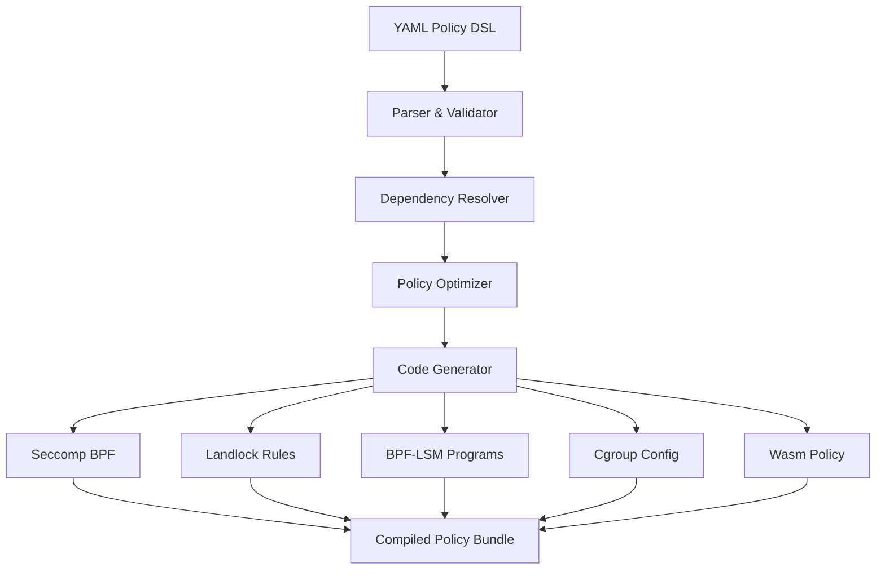

# Policy DSL to AOT-Compiled Runtime

## Overview

The **Policy DSL to AOT-Compiled Runtime** system transforms human-readable YAML policies into optimized kernel bytecode, achieving <50ms compilation time and zero runtime overhead.

## Core Architecture

```go
type PolicyDSLCompiler struct {
    // DSL parsing
    yamlParser          *YAMLPolicyParser
    policyValidator     *PolicyValidator
    dependencyResolver  *DependencyResolver
    
    // Code generation
    seccompGenerator    *SeccompBPFGenerator
    landlockGenerator   *LandlockRuleGenerator
    bpfLSMGenerator     *BPFLSMGenerator
    cgroupGenerator     *CgroupConfigGenerator
    
    // Cross-platform support
    wasmPolicyGenerator *WasmPolicyGenerator
    
    // Optimization
    policyOptimizer     *PolicyOptimizer
    cacheManager        *PolicyCacheManager
}

// Policy DSL example
type PolicyDSL struct {
    Profile     string                 `yaml:"profile"`
    Mode        string                 `yaml:"mode"`
    Runtime     string                 `yaml:"runtime"`
    Security    SecurityPolicyDSL      `yaml:"security"`
    Performance PerformancePolicyDSL   `yaml:"performance"`
    Resources   ResourcePolicyDSL      `yaml:"resources"`
    Network     NetworkPolicyDSL       `yaml:"network"`
    Adaptive    AdaptivePolicyDSL      `yaml:"adaptive"`
}

// Example policy DSL
const ExamplePolicyDSL = `
profile: python-ai-turbo
mode: sandbox
runtime: auto  # namespace on Linux, wasm elsewhere

security:
  level: medium
  capabilities: []
  seccomp: 
    default: deny
    allow:
      - read
      - write
      - openat
      - close
      - mmap
      - exit_group
  landlock:
    enabled: true
    paths:
      - path: /tmp
        access: read-write
      - path: /usr/lib/python3*
        access: read-only
  bpf_lsm:
    file_open: python-file-policy.bpf
    task_create: deny-fork.bpf

performance:
  zygote: true
  io_mode: uring
  memory_allocator: jemalloc
  cpu_affinity: numa-aware
  prefetch: python

resources:
  memory: 512MB
  cpu: 1.0
  pids: 256
  disk: 1GB
  timeout: 300s

network:
  mode: loopback-only
  dns: disabled
  outbound: []

adaptive:
  auto_upgrade: hardened
  auto_downgrade: direct  
  triggers:
    - network_access: upgrade
    - file_write_outside_tmp: upgrade
`

// AOT compilation process
func (pdc *PolicyDSLCompiler) CompilePolicy(dslContent string) (*CompiledPolicy, error) {
    start := time.Now()
    
    // Phase 1: Parse and validate DSL
    policy, err := pdc.yamlParser.Parse(dslContent)
    if err != nil {
        return nil, fmt.Errorf("DSL parsing failed: %w", err)
    }
    
    if err := pdc.policyValidator.Validate(policy); err != nil {
        return nil, fmt.Errorf("policy validation failed: %w", err)
    }
    
    // Phase 2: Resolve dependencies and optimize
    optimized, err := pdc.policyOptimizer.Optimize(policy)
    if err != nil {
        return nil, fmt.Errorf("policy optimization failed: %w", err)
    }
    
    // Phase 3: Generate platform-specific code
    compiled := &CompiledPolicy{}
    
    // Generate seccomp BPF
    compiled.SeccompBPF, err = pdc.seccompGenerator.Generate(optimized.Security.Seccomp)
    if err != nil {
        return nil, fmt.Errorf("seccomp generation failed: %w", err)
    }
    
    // Generate Landlock rules
    compiled.LandlockRules, err = pdc.landlockGenerator.Generate(optimized.Security.Landlock)
    if err != nil {
        return nil, fmt.Errorf("landlock generation failed: %w", err)
    }
    
    // Generate BPF-LSM programs
    compiled.BPFLSMPrograms, err = pdc.bpfLSMGenerator.Generate(optimized.Security.BPFLSM)
    if err != nil {
        return nil, fmt.Errorf("BPF-LSM generation failed: %w", err)
    }
    
    // Generate cgroup configuration
    compiled.CgroupConfig, err = pdc.cgroupGenerator.Generate(optimized.Resources)
    if err != nil {
        return nil, fmt.Errorf("cgroup generation failed: %w", err)
    }
    
    // Generate WebAssembly policy if needed
    if optimized.Runtime == "wasm" || optimized.Runtime == "auto" {
        compiled.WasmPolicy, err = pdc.wasmPolicyGenerator.Generate(optimized)
        if err != nil {
            return nil, fmt.Errorf("Wasm policy generation failed: %w", err)
        }
    }
    
    // Phase 4: Cache compiled policy
    compiled.CompiledAt = time.Now()
    compiled.CompilationTime = time.Since(start)
    compiled.PolicyHash = pdc.calculatePolicyHash(dslContent)
    
    // Validate compilation time target (<50ms)
    if compiled.CompilationTime > 50*time.Millisecond {
        return nil, fmt.Errorf("compilation too slow: %v (target: <50ms)", compiled.CompilationTime)
    }
    
    // Cache for future use
    pdc.cacheManager.Store(compiled.PolicyHash, compiled)
    
    return compiled, nil
}

// Seccomp BPF generation
func (sbg *SeccompBPFGenerator) Generate(seccompPolicy *SeccompPolicyDSL) ([]byte, error) {
    // Build BPF program
    program := &BPFProgram{}
    
    // Default action
    if seccompPolicy.Default == "deny" {
        program.AddInstruction(BPF_RET | BPF_K, SECCOMP_RET_KILL)
    }
    
    // Allow specific syscalls
    for _, syscall := range seccompPolicy.Allow {
        syscallNr := syscallNameToNumber(syscall)
        program.AddSyscallAllow(syscallNr)
    }
    
    // Compile to bytecode
    return program.Compile()
}

// WebAssembly policy generation for cross-platform
func (wpg *WasmPolicyGenerator) Generate(policy *OptimizedPolicy) (*WasmPolicy, error) {
    wasmPolicy := &WasmPolicy{
        WasiCapabilities: []string{},
        MemoryLimits:     policy.Resources.Memory,
        CPULimits:        policy.Resources.CPU,
    }
    
    // Convert filesystem rules to WASI capabilities
    for _, path := range policy.Security.Landlock.Paths {
        if path.Access == "read-only" {
            wasmPolicy.WasiCapabilities = append(wasmPolicy.WasiCapabilities, 
                fmt.Sprintf("wasi:filesystem/read@%s", path.Path))
        } else if path.Access == "read-write" {
            wasmPolicy.WasiCapabilities = append(wasmPolicy.WasiCapabilities,
                fmt.Sprintf("wasi:filesystem/read-write@%s", path.Path))
        }
    }
    
    // Convert network rules
    if policy.Network.Mode == "loopback-only" {
        wasmPolicy.WasiCapabilities = append(wasmPolicy.WasiCapabilities,
            "wasi:sockets/loopback")
    }
    
    return wasmPolicy, nil
}
```

## Compilation Pipeline


